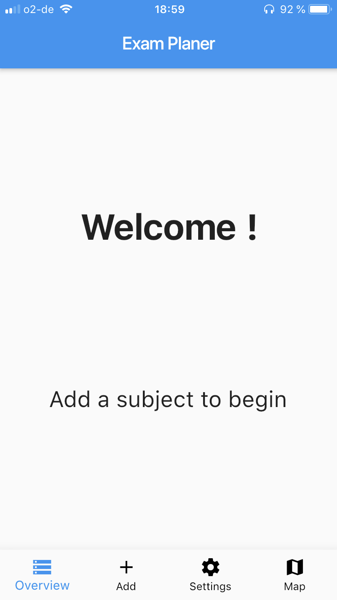
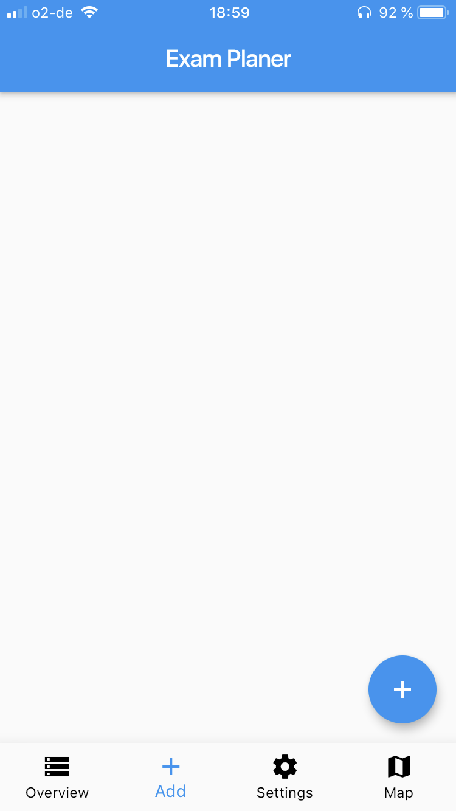
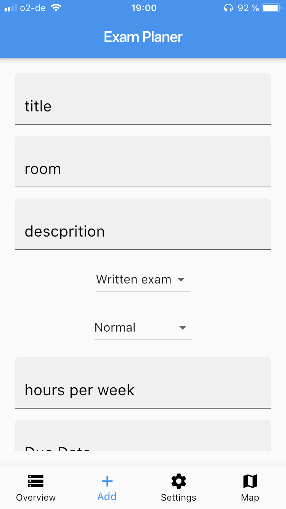

# apps4students-team-4
apps4students-team-4 created by GitHub Classroom

[git flow init](https://ob.cs.hm.edu/exercises.html)

[] (https://coveralls.io/github/mobileappdevhm19/apps4students-team-4?branch=develop)

[] (https://travis-ci.org/mobileappdevhm19/apps4students-team-4)

# Overview
Easy Study is an Application which supports your time management during/befor exams. It helps you by inputting the  Data for an exam and creating Learning Appointments for that exam. This is all based on simple Inputs like Duedate and estimated time needed.

# Installation
Download the App:
- [Here (iOS)](https://github.com/mobileappdevhm19/apps4students-team-4/wiki/)
- [Here (Android)](https://github.com/mobileappdevhm19/apps4students-team-4/wiki/)

# Usage

## Overview
The overview is the main screen of the app. You can find there the different statistics of the progression of every subject. 
The progress summary combines all the time spent of every subject. The progess is calculated in function of the settings of the hours/week and the due date in order to let the user know his progress.
You can track your time by pressing the subject card and starting the chronometer.

![]
## Add / Edit / Delete
You can add/edit/delete in this view. In order to add a subject, press the add button. Then you have to enter a title, room, description, exam type, priority, hours/week, due date and a color. You have to press the save button one time to confirm the input and a second press will save the subject.
You can modify/delete  the subject input anytime you want by pressing during 1 second the subject card in the add view.

## Export to calendar
It is possible to export the due date to your personal calendar, it will create events with the subject titles. 

## Map
The map of the different campus of Hochschule München is available in this view. 
