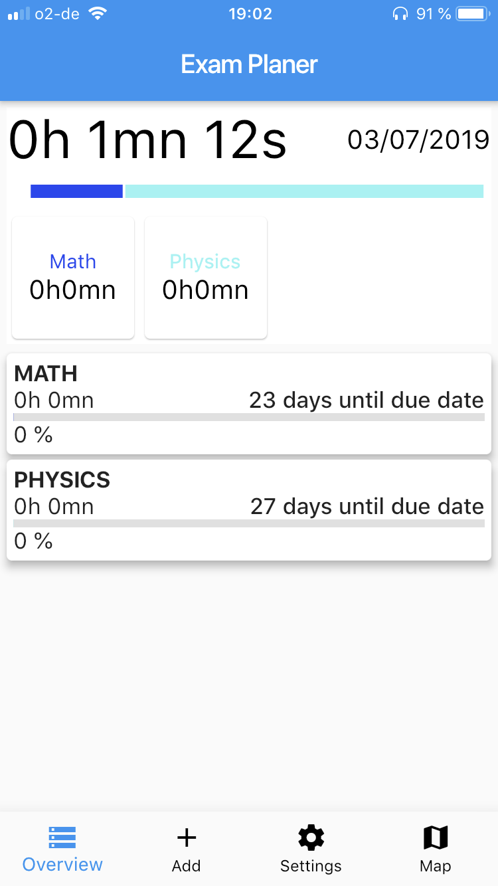

# apps4students-team-4
apps4students-team-4 created by GitHub Classroom

[git flow init](https://ob.cs.hm.edu/exercises.html)

[] (https://coveralls.io/github/mobileappdevhm19/apps4students-team-4?branch=master)

[] (https://travis-ci.org/mobileappdevhm19/apps4students-team-4)

# Overview
Easy Study is an Application which supports your time management during/before exams. It helps you by inputting the data for an exam and creating learning appointments for that exam. This is all based on simple inputs like duedate and estimated time needed.

# Installation
Download the app:
- [Here (Android)](https://play.google.com/store/apps/details?id=edu.hm.cs.mobile.easy_study)
You need to have permission to be a tester to download the app.

# Usage

## Overview
The overview is the main screen of the app. You can find there the different statistics of the progression of every subject. 
The progress summary combines all the time spent of every subject. The progess is calculated in function of the settings of the hours/week and the due date in order to let the user know his progress.
You can track your time by pressing the subject card and starting the chronometer.

## Add / Edit / Delete
You can add/edit/delete in this view. 
* In order to add a subject, press the add button. Then you have to enter a title, room, description, exam type, priority, hours/week, due date and a color. You have to press the save button one time to confirm the input and a second press will save the subject.
* You can modify/delete the subject with a long touch onto the subject card.

## Timetracking
You are able to track the time you spent learning on a subject. You simply have to touch in the 'Overview' onto the card of a subject and you get directed to the timetracking. By pressing the start button the tracker will track, even when you close the app. When you hit the stop button you will save the time onto your subject. It's also possible to undo the tracked time, if you made it by accident.

## Export to calendar
It is possible to export the due date to your personal calendar, it will create events with the subject titles. Before that you have to accept the permissions. The permissions are needed to access the calendar and write to it. The export to calendar is found under 'settings'. 

## Privacy Policy
The privacy policy is located under 'settings'. 

## Map
The map of the different campus of Hochschule München is available in this view. It shows the location of the Hochschule located in Pasing, Stachus and Lothstraße. You are able to zoom into the map.

## Architecture
We used the  architecture. 
It works like a store you put on top of ur app where you save the things you could need everywhere. We decided to save the widget which is displayed to the user, as well as the database helper. Changing the widget results in changing the state of the app which causes the widget tree to redraw. Also it is always nice to have access to the database. We decided to use this architecture, because then we can easily change the actual displayed widget and access the database wherever we need it instead of passing it down the tree.
Another good thing about the architecture is, that it is easy to test. You just have to create the store and build the app.

## Things that could be added
* We wanted to display a feedback on how long the student learned, f.e. 'Great job, now take a break'.
* Redesign the time tracking, the start button could change to a pause button, that the user is able to pause the tracking. But that is just some bells and whistles.
* Make the timetracking as a push notification, that the user is acknoledged about the tracked time, even when not inside the app.
* Add the building plans to see where the rooms are inside a single building.

# Credits to 
Created my free logo at LogoMakr.com @logomakr_com stored under https://logomakr.com/9txuR3
